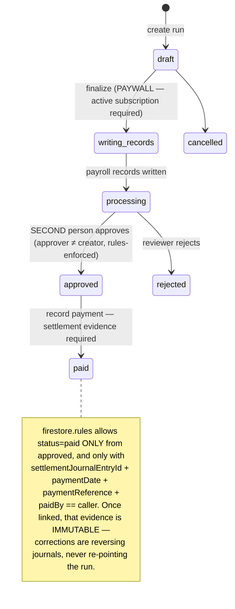
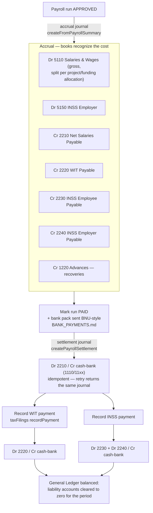
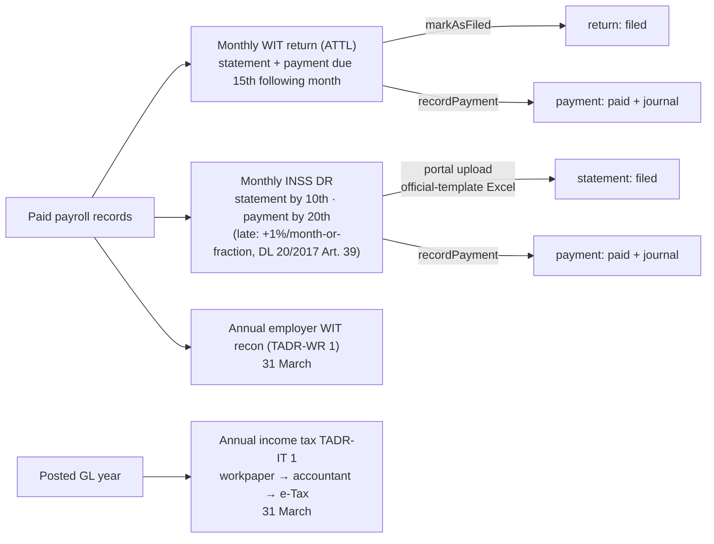

# The payroll money chain

How money moves from a payroll run to closed books — the load-bearing chain
behind Payroll → Money → Accounting → statutory filings. Read this before
touching payroll statuses, settlement, the payroll/tax journals, or
`firestore.rules` around `payruns`/`taxFilings`.

Sibling docs own the details: `BILLING.md` (the paywall on finalizing),
`BANK_PAYMENTS.md` (the BNU pack), `AUDIENCE_SPLIT.md` (who sees which tax
screens), `ACCOUNTING_AUTOMATIONS.md` (recurring/depreciation postings).

## 1. Run lifecycle (rules-enforced state machine)

Statuses: `client/types/payroll.ts` (`PayrollStatus`). The paid-gate rules:
`firestore.rules` `payruns` update clause. Tests:
`tests/rules/payroll-approval.test.ts`, browser proof in
`tests/e2e/full-workflow.spec.ts`.

## 2. Money → journals (all engine-exact, decimal.js)

Builders (pure, unit-tested): `client/lib/accounting/calculations.ts` —
`buildPayrollJournalLines`, `buildPayrollSettlementJournalLines`,
`buildLiabilityPaymentJournalLines`. Posting is exactly-once: retries return
the existing journal, never a duplicate (same pattern as the
`fixedAssetPostings` guards in `ACCOUNTING_AUTOMATIONS.md`). Recurring
deductions settle with the run — never posted twice.

## 3. Statutory filings & deadlines (return ≠ payment, always)

- Return submission and payment are **independent obligations** with separate
  statuses — a filed return with unpaid tax stays visibly overdue.
- Filing ownership (rules-enforced read split on `taxFilings`): wage filings
  (WIT/INSS) belong to **Payroll**; business tax (`annual_income_tax`,
  `services_tax`, `installment_tax`) belongs to **Accounting**.
- Statutory exports mirror OFFICIAL templates only (INSS portal DR, ATTL
  form); the TADR-IT 1 workpaper is Xefe's own layout and is a preparation
  aid — Xefe never claims to calculate or file the official annual return
  (`officialFormSupported: false` until accountant sign-off).

## 4. Invariants (the things that must never regress)

| # | Invariant | Enforced by |
|---|-----------|-------------|
| 1 | Finalizing payroll is the ONLY paywall | `isTenantSubscribed()` ↔ rules `tenantHasActiveSubscription()` (`BILLING.md`) |
| 2 | Approver ≠ creator (two-person rule) | `firestore.rules` payruns + `payroll-approval.test.ts` |
| 3 | `paid` only from `approved`, with immutable settlement evidence | `firestore.rules` payruns update clause |
| 4 | Every money move has exactly one balanced journal; retries are idempotent | service transactions + journal-by-source lookups |
| 5 | Corrections = reversing journals; never delete/repoint | `voidJournalEntry`/`createReversingJournalEntry` |
| 6 | Statutory generation refuses on missing data — Xefe never infers compliance values | strict readers in `lib/tax/statutory-payroll-record.ts` |
| 7 | Audit trail: `payroll.run/approve/pay`, `tax.*` actions written via server callable | `functions/src/audit.ts` allowlist + E2E assertion |

The whole chain is proven end-to-end in one browser pass:
`tests/e2e/full-workflow.spec.ts` (signup → … → liability-clearing journals),
and against a real firm's filed month in the golden-month suite.
