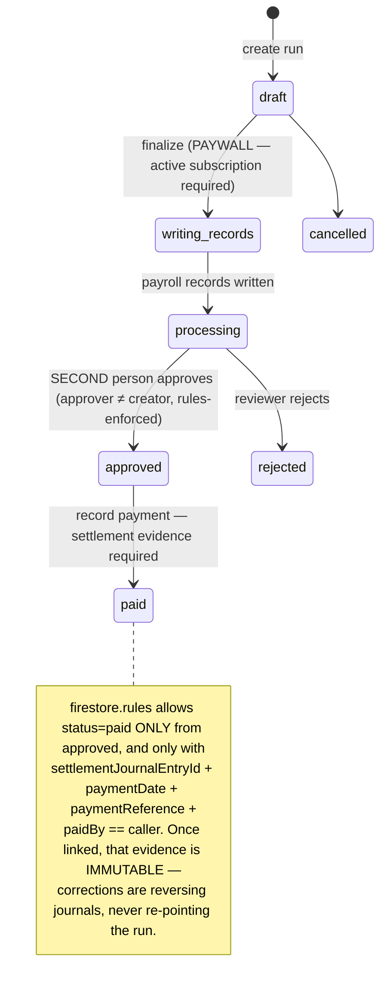
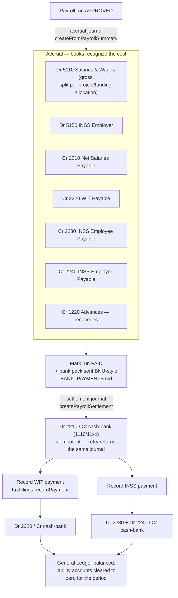
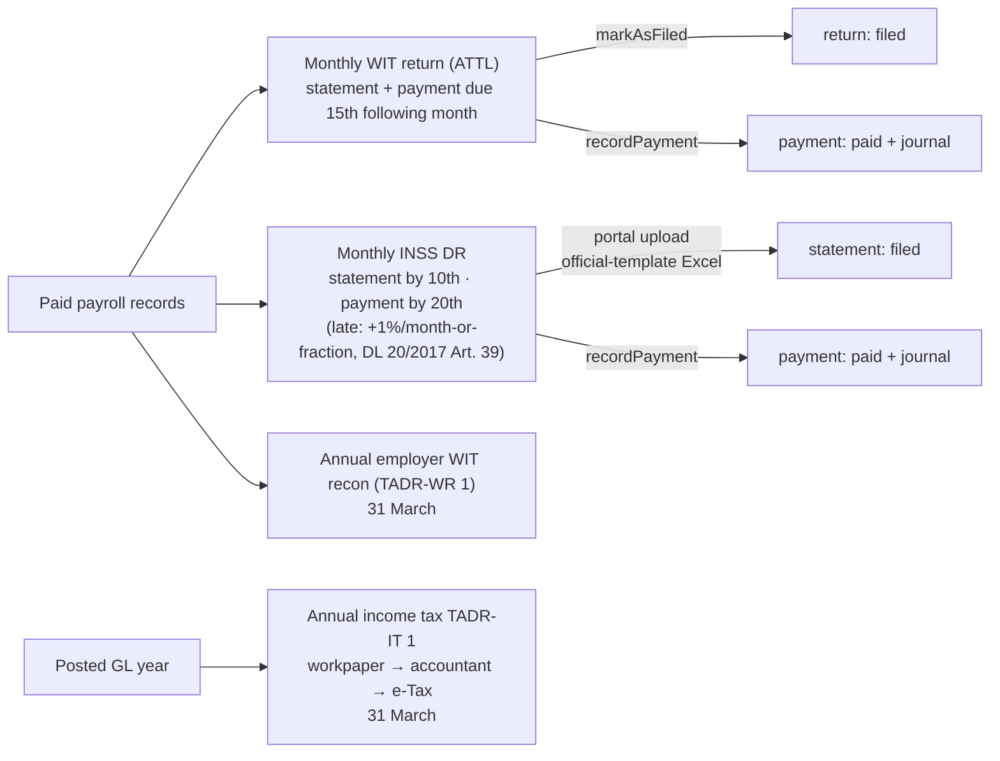

# The payroll money chain

How money moves from a payroll run to closed books — the load-bearing chain
behind Payroll → Money → Accounting → statutory filings. Read this before
touching payroll statuses, settlement, the payroll/tax journals, or
`firestore.rules` around `payruns`/`taxFilings`.

Sibling docs own the details: `BILLING.md` (the paywall on finalizing),
`BANK_PAYMENTS.md` (the BNU pack), `AUDIENCE_SPLIT.md` (who sees which tax
screens), `ACCOUNTING_AUTOMATIONS.md` (recurring/depreciation postings).

## 1. Run lifecycle (rules-enforced state machine)

```mermaid
stateDiagram-v2
    [*] --> draft : create run
    draft --> writing_records : finalize (PAYWALL — active subscription required)
    writing_records --> processing : payroll records written
    processing --> approved : SECOND person approves (approver ≠ creator, rules-enforced)
    processing --> rejected : reviewer rejects
    approved --> paid : record payment — settlement evidence required
    draft --> cancelled
    note right of paid
        firestore.rules allows status=paid ONLY from approved, and only with
        settlementJournalEntryId + paymentDate + paymentReference +
        paidBy == caller. Once linked, that evidence is IMMUTABLE —
        corrections are reversing journals, never re-pointing the run.
    end note
```

Statuses: `client/types/payroll.ts` (`PayrollStatus`). The paid-gate rules:
`firestore.rules` `payruns` update clause. Tests:
`tests/rules/payroll-approval.test.ts`, browser proof in
`tests/e2e/full-workflow.spec.ts`.

## 2. Money → journals (all engine-exact, decimal.js)

```mermaid
flowchart TD
    RUN[Payroll run APPROVED] -->|accrual journal\ncreateFromPayrollSummary| ACCRUE

    subgraph ACCRUE [Accrual — books recognize the cost]
        direction LR
        D1["Dr 5110 Salaries & Wages (gross,\nsplit per project/funding allocation)"]
        D2[Dr 5150 INSS Employer]
        C1[Cr 2210 Net Salaries Payable]
        C2[Cr 2220 WIT Payable]
        C3[Cr 2230 INSS Employee Payable]
        C4[Cr 2240 INSS Employer Payable]
        C5[Cr 1220 Advances — recoveries]
    end

    ACCRUE --> PAY[Mark run PAID\n+ bank pack sent BNU-style\nBANK_PAYMENTS.md]
    PAY -->|settlement journal\ncreatePayrollSettlement| SETTLE["Dr 2210 / Cr cash-bank (1110/11xx)\nidempotent — retry returns the same journal"]

    SETTLE --> WITP[Record WIT payment\ntaxFilings recordPayment]
    SETTLE --> INSSP[Record INSS payment]
    WITP --> WJ["Dr 2220 / Cr cash-bank"]
    INSSP --> IJ["Dr 2230 + Dr 2240 / Cr cash-bank"]

    WJ --> GL[General Ledger balanced:\nliability accounts cleared to zero for the period]
    IJ --> GL
```

Builders (pure, unit-tested): `client/lib/accounting/calculations.ts` —
`buildPayrollJournalLines`, `buildPayrollSettlementJournalLines`,
`buildLiabilityPaymentJournalLines`. Posting is exactly-once: retries return
the existing journal, never a duplicate (same pattern as the
`fixedAssetPostings` guards in `ACCOUNTING_AUTOMATIONS.md`). Recurring
deductions settle with the run — never posted twice.

## 3. Statutory filings & deadlines (return ≠ payment, always)

```mermaid
flowchart LR
    REC[Paid payroll records] --> WIT["Monthly WIT return (ATTL)\nstatement + payment due 15th following month"]
    REC --> DR["Monthly INSS DR\nstatement by 10th · payment by 20th\n(late: +1%/month-or-fraction, DL 20/2017 Art. 39)"]
    REC --> AWIT["Annual employer WIT recon (TADR-WR 1)\n31 March"]
    GLBOOKS[Posted GL year] --> AIT["Annual income tax TADR-IT 1\nworkpaper → accountant → e-Tax\n31 March"]

    WIT -- markAsFiled --> F1[return: filed]
    WIT -- recordPayment --> P1[payment: paid + journal]
    DR -- portal upload\nofficial-template Excel --> F2[statement: filed]
    DR -- recordPayment --> P2[payment: paid + journal]
```

- Return submission and payment are **independent obligations** with separate
  statuses — a filed return with unpaid tax stays visibly overdue.
- Filing ownership (rules-enforced read split on `taxFilings`): wage filings
  (WIT/INSS) belong to **Payroll**; business tax (`annual_income_tax`,
  `services_tax`, `installment_tax`) belongs to **Accounting**.
- Statutory exports mirror OFFICIAL templates only (INSS portal DR, ATTL
  form); the TADR-IT 1 workpaper is Xefe's own layout and is a preparation
  aid — Xefe never claims to calculate or file the official annual return
  (`officialFormSupported: false` until accountant sign-off).

## 4. Invariants (the things that must never regress)

| # | Invariant | Enforced by |
|---|-----------|-------------|
| 1 | Finalizing payroll is the ONLY paywall | `isTenantSubscribed()` ↔ rules `tenantHasActiveSubscription()` (`BILLING.md`) |
| 2 | Approver ≠ creator (two-person rule) | `firestore.rules` payruns + `payroll-approval.test.ts` |
| 3 | `paid` only from `approved`, with immutable settlement evidence | `firestore.rules` payruns update clause |
| 4 | Every money move has exactly one balanced journal; retries are idempotent | service transactions + journal-by-source lookups |
| 5 | Corrections = reversing journals; never delete/repoint | `voidJournalEntry`/`createReversingJournalEntry` |
| 6 | Statutory generation refuses on missing data — Xefe never infers compliance values | strict readers in `lib/tax/statutory-payroll-record.ts` |
| 7 | Audit trail: `payroll.run/approve/pay`, `tax.*` actions written via server callable | `functions/src/audit.ts` allowlist + E2E assertion |
| 8 | Deduction LINES never sum to more than `cashGrossPay`, so `gross − deductions = net` always holds | clamp in `calculateTLPayroll` + `payroll-journal.test.ts` (engine → summary → journal) |
| 9 | A leaver's Art. 56 severance and Art. 44 subsídio are each paid exactly once, and the Art. 44 test is per-civil-year | `getCommittedFinalPayByEmployee` + `committedSubsidioDischarging` + `final-pay-dedup.test.ts` |

### 4a. Final-pay once-only guard — the two scopes are NOT the same

This subsystem caused four separate money bugs in July 2026, three of them in
*fixes* for the previous one, so the reasoning is recorded here rather than only
in code comments.

- **Art. 56 severance is suppressed year-agnostically.** Any committed
  `service_compensation` in the looked-up window blocks a second one, because a
  second run over the same period must never re-pay it. (Whether Art. 56 is
  once-per-*employment* rather than once-per-year matters only for a rehire and is
  OPEN — gap matrix F20. Widening it all-time would underpay a genuinely rehired
  worker who completes a fresh 5-year block, so it is deliberately left alone.)
- **Art. 44 subsídio is per civil year**, so it may only be netted against the
  *same* year's committed amount. Do **not** try to key this on "the civil year a
  run discharges" — that question is unanswerable from a run: a wage period
  straddling 1 January touches two years and nothing on a payroll record says
  which one its subsídio was computed for. Both naive keys are wrong in opposite
  directions (year-agnostic paid a January leaver $0 of what they were owed;
  anchoring on `periodEnd` re-paid a December leaver in full). The rule is a
  predicate over *(run period, termination date)* — `committedSubsidioDischarging`.
- **The lookup spans every civil year the wage period touches**
  (`finalPayDedupYears`), and includes `writing_records` runs: their records are
  committed in the same atomic batch as the run doc, so a stuck run holds real
  money that `repairStuckRun` will promote. Missing them pays twice; counting an
  abandoned partial run only suppresses a payment, which is visible and transient.
- **Roster membership is one-sided.** A terminated employee belongs on any run
  whose period began before their employment ended (`employedDuringPeriod`),
  because the default schedule pays the *preceding* month — a two-sided test meant
  a fully worked month could be paid by no run at all. `getInPeriodTermination`
  keeps its two-sided test; it gates the final-pay items and the proration end,
  not roster membership.

- **A rehire scopes BOTH sides.** The rehire action moves `hireDate`, which
  prorates the Art. 44 entitlement from the new start date — so the netting must
  ignore runs that finished before it (`engagementStart`). Scoping only one side
  charged the worker twice for the same months: $600/month, worked Jan-Mar 2026
  (paid 3/12 = $150), rehired 1 Jul, left 31 Oct paid 4/12 - $150 = $50, i.e. $200
  against 7 months worked ($350). Entitlement and netting must always be computed
  at the same scope — every bug in this subsystem so far has been a mismatch
  between the two.

Any change here needs `final-pay-dedup.test.ts`, `rl-termination-payroll.test.ts`
and `payroll-journal.test.ts` green, and those tests must exercise the shape the
**service** actually returns — a test built on a hand-made input shape hid one of
the four bugs completely.

The whole chain is proven end-to-end in one browser pass:
`tests/e2e/full-workflow.spec.ts` (signup → … → liability-clearing journals),
and against a real firm's filed month in the golden-month suite.
